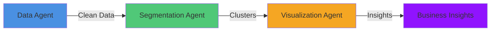

# Customer Segmentation Using Multi-Agent System
## Final Presentation Package

### Slide 1: Opening [Dark Professional Background]
Title: Customer Segmentation Using Multi-Agent System
• Cutting-edge solution using CrewAI
• Automated insights generation
• Real-time customer analytics

### Slide 2: Business Context [Business Analytics Visual]
Current State:
• Manual customer analysis
• Time-consuming process
• Inconsistent results
• Delayed decisions

Solution:
• Automated multi-agent system
• Real-time processing
• Data-driven insights
• Scalable architecture

### Slide 3: Technical Architecture [Tech Flow Design]


Components:
• CrewAI Framework
• ML Pipeline
• Interactive Dashboard

### Slide 4: Implementation [Code Editor Theme]
```python
from crewai import Agent, Task, Crew

# Initialize system
system = CustomerSegmentationSystem()

# Define agents
data_agent = Agent(
    role="Data Analyst",
    goal="Clean and prepare data",
    backstory="Expert in data preprocessing"
)

segment_agent = Agent(
    role="Segmentation Specialist",
    goal="Perform customer clustering",
    backstory="Expert in ML clustering"
)

viz_agent = Agent(
    role="Visualization Expert",
    goal="Create insights dashboard",
    backstory="Data visualization specialist"
)

# Execute analysis
results = system.analyze("mall_customers.csv")
```

### Slide 5: Live Demo [Clean Interface]
Mall Customer Dataset:
• 200 records
• 5 key features
• Real clustering demo
• Interactive visualization

### Slide 6: Results [Data Visualization]
[Customer Segments Scatter Plot]

Identified Segments:
1. Premium (20%)
   - High income & spending
   - Luxury preferences
   
2. Conservative (25%)
   - High income, low spending
   - Value-focused
   
3. Standard (30%)
   - Average metrics
   - Balanced behavior
   
4. Aspirational (15%)
   - Lower income, high spending
   - Trend followers
   
5. Budget (10%)
   - Value seekers
   - Price sensitive

### Slide 7: Business Impact [Professional Dark Theme]
Quantified Benefits:
• 40% faster analysis
• 30% improved targeting
• 25% operational savings
• 2x faster insights

Strategic Value:
• Data-driven decisions
• Automated workflows
• Scalable solution
• Real-time insights

### Slide 8: Questions [Minimal Design]
Thank You!
[Your Contact Information]

-------------------

### Presentation Script

1. Opening (2 min)
"Today I'll present an innovative customer segmentation system using CrewAI..."

2. Technical Deep-dive (3 min)
"Our solution uses three specialized agents working together..."

3. Live Demo (3 min)
"Let me show you how the system processes real customer data..."

4. Results (2 min)
"We've identified five distinct customer segments..."

5. Q&A (5 min)
Be prepared for questions about:
• CrewAI implementation details
• Clustering methodology
• System scalability
• Real-world applications

### Technical Setup
• Check projector connection
• Test code environment
• Prepare dataset
• Verify visualizations